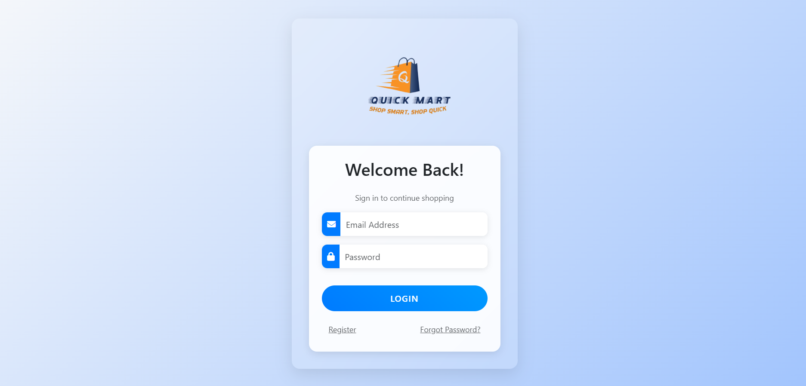

# 🛒 E-Commerce Website

A fully responsive e-commerce website built with modern web technologies.

## 🚀 Features

- Responsive design that works on all devices
- Interactive product catalog
- Product search and filtering
- Shopping cart functionality
- Secure checkout process
- User authentication

## 💻 Tech Stack

- **Frontend:**
  - HTML5
  - CSS3
  - JavaScript 
  - RESTful APIs integration

## 🚀 Getting Started

##  Screenshots of the website
### 🔐 Login Page

### ✍️ Register Page

### ℹ️ About Page

### 🛍️ Product View

### 🛒 Shopping Cart

### ✅ Order Placed

### Prerequisites
- Web browser
- Text editor (VS Code recommended)

## 📝 Usage
Browse the product catalog
Add items to cart
Proceed to checkout
Complete the purchase

